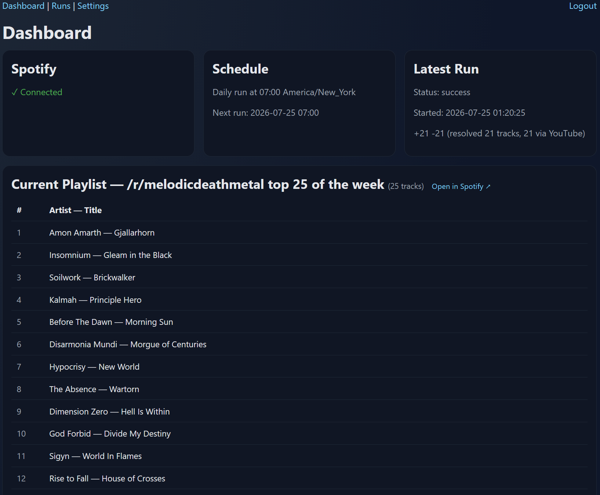
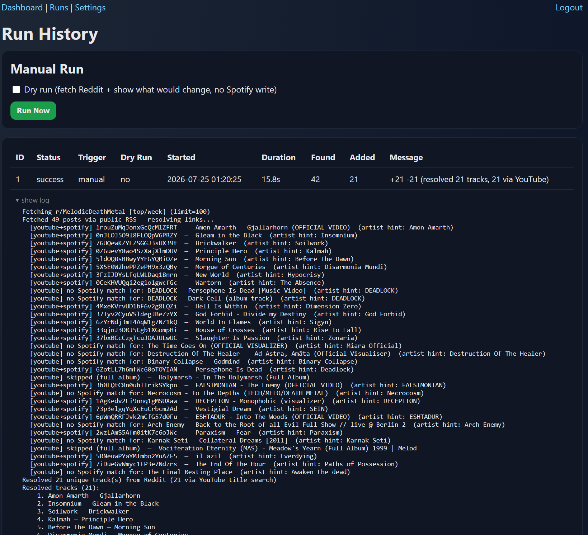

# Subreddit Sounds

**Turn what a music subreddit is posting into a Spotify playlist that stays fresh on its own.**

Point Subreddit Sounds at a subreddit and it keeps a Spotify playlist stocked
with the tracks that community is sharing, refreshed automatically every day.
It's self-hosted: one Docker container, a SQLite file, and a small web admin
console. No config files and no API keys on disk; everything is set up in the
browser on first run.

> **Live example:** a public playlist this keeps updated automatically →
> [open in Spotify](https://open.spotify.com/playlist/1UXnaj6qDYSoQW4745cndy)

## What it does

Once a day (default 07:00, configurable), Subreddit Sounds:

1. **Pulls the top posts** from your chosen subreddit(s), via Reddit's public
   RSS feed, or the OAuth API if you add credentials.
2. **Resolves each post to a Spotify track.** Direct Spotify links are taken
   as-is; YouTube links get their title and artist parsed (using the channel as
   an artist hint) and searched on Spotify. Results are filtered by genre and
   minimum duration, and full-album links are skipped.
3. *(Optional)* also pulls **Bandcamp** new releases by tag.
4. **Reconciles the playlist to the latest N tracks** (default 25): adds the
   new finds and trims the oldest, so you get a rolling, always-current playlist
   instead of an ever-growing dump.

Everything runs through a web admin console: a first-run **setup wizard**, a
manual **Run now** button, and **run history** with full per-run logs.

## How it works

```
subreddit(s) ──▶ fetch top posts ──▶ resolve links to Spotify tracks ──▶ reconcile playlist
(Reddit RSS/API)   (+ Bandcamp tags)   (direct links + YouTube matching)   (add new / trim to cap)
```

- **Scheduler:** an in-app daily cron job (APScheduler). Time and timezone are
  set in the wizard (default 07:00 `America/New_York`).
- **Storage:** SQLite in a mounted volume. Your Reddit/Spotify credentials and
  all settings live in the database, never in the repo or image.
- **Sessions:** the cookie-signing key is auto-generated and persisted to the
  data volume on first run, nothing to configure.

## Screenshots

**Dashboard**: status, next scheduled run, and manual controls:



**Run history**: every sync with its full log:



## Requirements

- A working **Docker** install. New to Docker? See Docker's
  [official install docs](https://docs.docker.com/engine/install/) or
  DigitalOcean's
  [How To Install and Use Docker](https://www.digitalocean.com/community/tutorials/how-to-install-and-use-docker-on-ubuntu-22-04)
  guide first.
- A **Spotify** account (you connect it from the admin console).
- Optionally, **Reddit API** credentials for higher rate limits (the public RSS
  feed works without them).

## Quick start (Docker Compose)

```bash
git clone https://github.com/matt-taylor-tech/subreddit-sounds.git
cd subreddit-sounds
docker compose up -d --build
```

Then open `http://localhost:8000/` and complete the setup wizard.

To serve on a different host port: `APP_PORT=9000 docker compose up -d --build`.

## Quick start (docker run)

```bash
docker build -t subreddit-sounds .
docker run -d \
  --name subreddit-sounds \
  --restart unless-stopped \
  -p 8000:8000 \
  -v subreddit-sounds-data:/app/data \
  subreddit-sounds
```

Change the left side of `-p` (e.g. `-p 9000:8000`) to serve on another port.

## First-run setup

1. Open the app; the first visit redirects you to `/setup`.
2. Create your **admin login**.
3. Connect **Spotify** and paste the target **playlist ID** (the id from the
   playlist's share URL).
   > **Connecting Spotify:** if your Spotify redirect/callback URI is a loopback
   > address (`http://127.0.0.1:8000/callback`), you must complete the Spotify
   > connection from a browser on the same machine that runs the app, so the
   > callback resolves back to the app. On a headless server, tunnel it first:
   > `ssh -L 8000:localhost:8000 user@host`, then open `http://127.0.0.1:8000`
   > on your own computer. You only need to connect once; the token is stored on
   > the server, so afterwards you can administer the app from any computer.
4. Choose your **subreddit**, **schedule**, and any **filters** (genre, minimum
   track length, playlist cap).
5. Hit **Run now** to do a first sync, or wait for the daily job.

That's it: no `.env`, no secrets on disk.

## Updating

Your database and secret key live in the data volume, so they survive upgrades.

**Docker Compose:**

```bash
git pull
docker compose up -d --build
```

**docker run:**

```bash
git pull
docker build -t subreddit-sounds .
docker stop subreddit-sounds && docker rm subreddit-sounds
docker run -d \
  --name subreddit-sounds \
  --restart unless-stopped \
  -p 8000:8000 \
  -v subreddit-sounds-data:/app/data \
  subreddit-sounds
```

Recreating the container is expected; nothing persistent lives inside it.

## Configuration

All configuration is done in the admin console and stored in the database:

- **Source:** subreddit, sort (`top`), and timeframe (`week`); optional Bandcamp tags.
- **Reddit credentials:** optional; unlocks the OAuth API instead of public RSS.
- **Matching filters:** genre filter, minimum track duration, playlist size cap.
- **Schedule:** daily run time and timezone, or disable the schedule entirely.

The only optional environment variables (rarely needed) are `APP_PORT`,
`DATABASE_URL`, and `SECRET_KEY`; pass them with `-e` / `environment:` if you
want to override a default.

## Data & backups

Everything persistent lives in the data volume (`/app/data`): the SQLite
database and the auto-generated secret key. Back the database up regularly:

```bash
docker cp subreddit-sounds:/app/data/subreddit-sounds.db ./subreddit-sounds-backup-$(date +%Y%m%d).db
```

Your data is untouched across image rebuilds and upgrades.

## Security

- The session key is auto-generated and persisted on first run; keep the
  `data/` volume private, since it holds that key and the database.
- Set your admin credentials in the setup wizard.
- For internet-facing deployments, put it behind a reverse proxy (e.g. Nginx)
  with TLS rather than exposing port 8000 directly.
- All API secrets live in the database volume, never in the repo or image.

## Development

```bash
pip install -r requirements.txt
uvicorn app.main:app --reload   # nothing to configure; a secret key is generated on first run
pytest
```

## License

[MIT](LICENSE)
